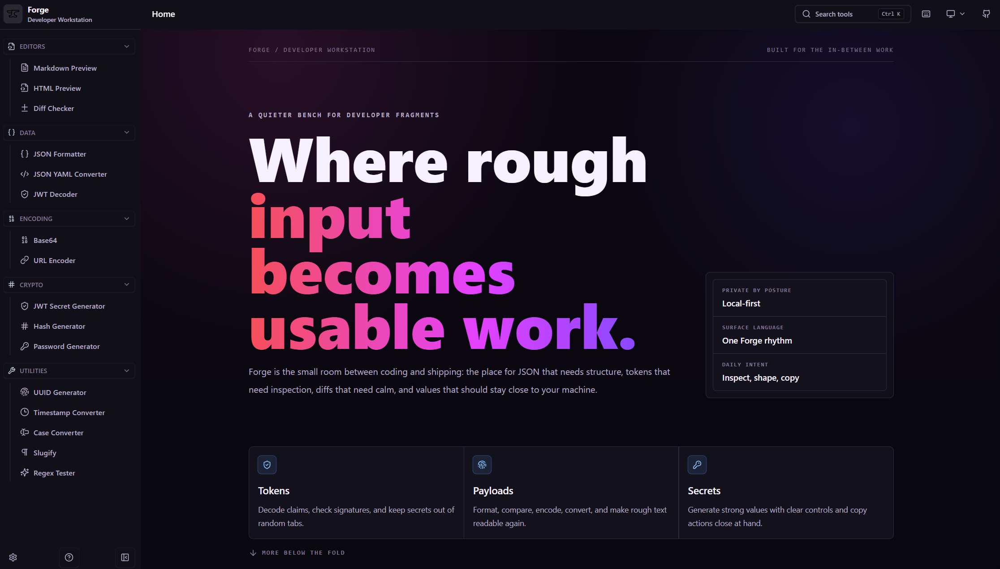

# Forge

Forge is a local-first developer workstation for the small but constant tasks
that happen between writing code and shipping it.

Use it to preview Markdown and HTML, compare text, format JSON, inspect JWTs,
encode data, generate secrets, test regular expressions, and clean up everyday
developer input without jumping across unrelated tabs.



## Why Forge Exists

Developers often handle sensitive, temporary, messy text:

- JWTs copied from logs
- JSON payloads from APIs
- YAML configuration snippets
- URLs that need decoding
- secrets that need generating
- text that needs comparing before a commit
- timestamps, UUIDs, slugs, hashes, and regex checks

Forge keeps these tasks in one calm interface with consistent controls,
keyboard-friendly navigation, and a privacy-first model.

## Highlights

- **Local-first workflows**  
  Core tools run in the browser. Sensitive input stays close to your device.

- **One product language**  
  Tools share the same layout patterns, copy actions, toolbar behavior,
  keyboard shortcuts, and visual system.

- **Fast command access**  
  Open the command palette with `Ctrl K` and jump directly to a tool.

- **Light, dark, and system themes**  
  The dark theme is tuned for a soft Forge palette rather than pure black.

- **Useful by default**  
  Tools include realistic examples, validation states, copy/export actions, and
  workspace persistence where it helps.

## Tools

### Editors

- Markdown Preview
- HTML Preview
- Diff Checker

### Data

- JSON Formatter
- JSON YAML Converter
- JWT Decoder

### Encoding

- Base64
- URL Encoder

### Crypto

- JWT Secret Generator
- Hash Generator
- Password Generator

### Utilities

- UUID Generator
- Timestamp Converter
- Case Converter
- Slugify
- Regex Tester

## Documentation

- [Documentation home](docs/README.md)
- [Product overview](docs/product.md)
- [Tool guide](docs/tools.md)
- [Privacy model](docs/privacy.md)
- [Keyboard shortcuts](docs/shortcuts.md)
- [Deployment notes](docs/deployment.md)
- [Support](docs/support.md)

## Local Development

Requirements:

- Node.js 22 or newer
- pnpm 10 or newer

Install dependencies:

```bash
pnpm install
```

Start the development server:

```bash
pnpm dev
```

Run the quality gate:

```bash
pnpm check
```

Build for production:

```bash
pnpm build
```

## Deployment

Forge is a static Vite app. Any static host can serve it after `pnpm build`.

For single-page app routing, configure the host to fall back every route to
`index.html`. This keeps routes such as `/tools/jwt-decoder`, `/privacy`, and
`/terms` working after refresh.

## Privacy

Forge is designed for sensitive developer workflows. The core tools process
input locally in the browser and do not require an account or backend service.

Read more in [docs/privacy.md](docs/privacy.md).

## Support

- Ask a question: [docs/support.md](docs/support.md)
- Report an issue: [github.com/orcace/forge/issues](https://github.com/orcace/forge/issues)
- Share feedback: [docs/support.md](docs/support.md)

## License

MIT License. See [LICENSE](LICENSE).
